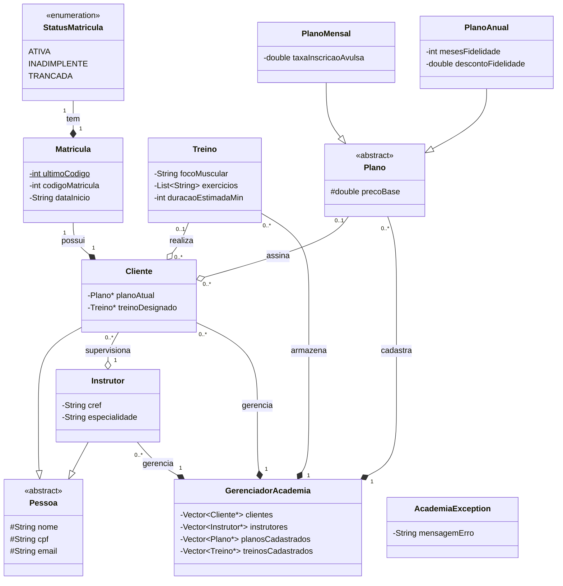

# Sistema de Gestão de uma Academia
Esse projeto foi feito para a matéria de **Linguagem de Programação I**.

## 🗂️ Arquitetura do Projeto
A arquitetura do projeto foi modularizada para separar as definições de tipos, as implementações lógicas e os arquivos gerados no ciclo de compilação:

```plaintext
/SISTEMA-ACADEMIA
├───/bin                         # Arquivos gerados na compilação
├───/data                        # Arquivos de persistência de dados
├───/include                     # Arquivos de cabeçalho (.hpp)
├───/src                         # Implementação das classes (.cpp)
├───Makefile                     # Automação do processo de compilação
├───.gitignore                   # Arquivos e diretórios ignorados pelo Git
└───README.md                    # Documentação principal do projeto
```

### 1. sistema-academia/ (Raiz): 

Diretório principal do projeto. Contém os arquivos de configuração global como o Makefile , .gitignore e a documentação principal (README.md)

### 2. bin/ (Binários): 

Armazena todos os arquivos de objeto intermediários (.o) e o arquivo executável final do sistema. Esta pasta é gerada automaticamente pelo Makefile e não deve ser enviada para o repositório Git (deve estar no .gitignore).

### 3. data/ (Persistência): 

Destinada aos arquivos de texto (.txt) utilizados para salvar e carregar os dados cadastrais do sistema entre as execuções da aplicação.

### 4. include/ (Cabeçalhos / Headers): 

Contém os arquivos de extensão .hpp. É onde ficam as declarações das 9 classes , atributos, protótipos de métodos e as definições de exceções personalizadas. Nenhuma lógica de código deve ser escrita aqui.

### 5. src/ (Fontes / Source): 

Contém os arquivos de extensão .cpp com a implementação real da lógica declarada nos headers, além do arquivo main.cpp , que gerencia o menu de interação via terminal.


## ⚙️ Como Compilar

### make:

**O que faz:** Compila de forma incremental todo o projeto.

**Como funciona:** O make varre a pasta src/, identifica quais arquivos .cpp foram criados ou modificados, gera seus respectivos arquivos de objeto .o dentro de bin/ e faz a linkagem final para construir o executável. Se nenhum arquivo foi modificado desde a última compilação, ele avisa que o alvo já está atualizado, poupando tempo.

### make run

**O que faz:** Compila o projeto (caso haja alguma alteração pendente) e inicia a aplicação imediatamente.

**Como funciona:** Ele dispara o processo padrão do make e, logo em seguida, executa o arquivo binário gerado, abrindo o menu interativo no terminal. É o comando ideal para testar o código rapidamente durante o desenvolvimento.  

### make clean

**O que faz:** Limpa o ambiente de desenvolvimento deletando os arquivos gerados pela compilação.

**Como funciona:** Ele remove completamente o diretório bin/ e tudo o que está dentro dele. É útil usar este comando antes de criar arquivos compactados (.zip) para entrega  ou para forçar uma compilação do zero quando ocorrer algum erro estranho de cache de arquivos.  

## 📑 Diagrama de Classes



<!--  -->
